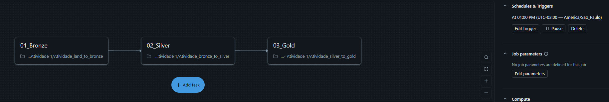
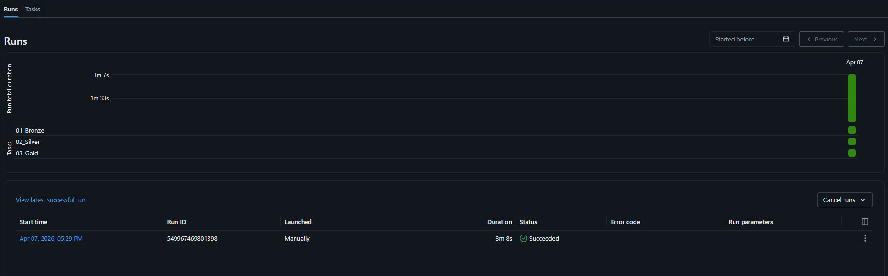

# Arquitetura Medalhão com Databricks

Projeto de Engenharia de Dados desenvolvido com base no dataset **Olist**, utilizando a arquitetura medalhão (**Bronze, Silver e Gold**) no **Databricks**.

## Objetivo

Construir uma pipeline de dados capaz de:

- ingerir dados brutos de múltiplos arquivos CSV;
- coletar a cotação do dólar via API do Banco Central;
- organizar e padronizar os dados em camadas analíticas;
- gerar tabelas consolidadas para análise de negócio;
- automatizar a execução do processo com **Databricks Workflows**.

## Estrutura do Projeto

- `01-Ingestao_para_Bronze.ipynb`  
  Responsável pela ingestão dos arquivos CSV e da API de cotação do dólar para a camada Bronze.

- `02-Bronze_para_Silver.ipynb`  
  Responsável pela limpeza, padronização, deduplicação, tipagem e aplicação das regras de negócio na camada Silver.

- `03-Silver_para_Gold.ipynb`  
  Responsável pela construção dos Data Marts analíticos e geração dos indicadores da camada Gold.

- `job_medalhao_rocketlab.yaml`  
  Definição do workflow no Databricks para orquestração sequencial dos notebooks.

## Arquitetura

### Bronze
Camada de ingestão dos dados brutos, preservando os registros originais e adicionando a coluna `timestamp_ingestion`.

### Silver
Camada de tratamento e transformação, com:
- renomeação de colunas para português;
- padronização de tipos;
- tratamento de valores nulos;
- deduplicação com Window Functions;
- aplicação de regras de negócio.

### Gold
Camada analítica final, contendo tabelas agregadas e visões para apoio à tomada de decisão.

## Tecnologias Utilizadas

- Databricks
- PySpark
- Delta Lake
- Databricks Workflows
- API do Banco Central do Brasil
- GitHub

## Orquestração

O projeto conta com um workflow no Databricks com execução sequencial das etapas:

`Bronze -> Silver -> Gold`

Além disso, foi configurado um agendamento diário para automatizar a atualização dos dados.

## Dataset

Base utilizada: **Olist E-Commerce Dataset**

Complemento externo:
- **API PTAX do Banco Central** para ingestão da cotação do dólar.

## Imagens da Pipeline:

### Workflow no Databricks

### Execução com Sucesso

